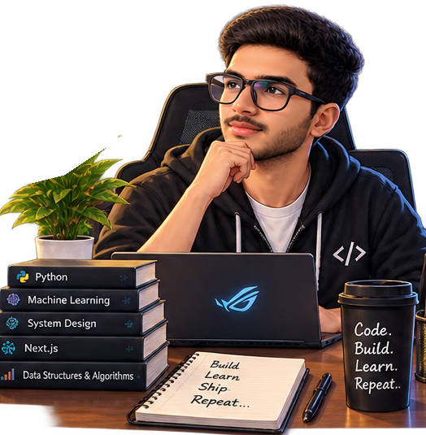

  

<h2 align="center">01 // IDENTITY</h2>

  <b>AI/ML Engineer Aspirant</b> · Chandigarh University · 3rd Year

  I build intelligent systems, AI-powered products, and scalable software
  that solve real problems.

  <code>AI / ML</code>
  <code>LLMs</code>
  <code>RAG</code>
  <code>Agents</code>
  <code>Backend Systems</code>
  <code>Product Engineering</code>

<h2 align="center">02 // CURRENTLY</h2>

<table align="center">
  <tr>
    <td align="right"><code>&nbsp;&nbsp;&nbsp;STATUS</code></td>
    <td>&nbsp;→&nbsp;</td>
    <td>Open to Software / AI Internships</td>
  </tr>
  <tr>
    <td align="right"><code>&nbsp;BUILDING</code></td>
    <td>&nbsp;→&nbsp;</td>
    <td>CareerSphere</td>
  </tr>
  <tr>
    <td align="right"><code>&nbsp;&nbsp;SOLVING</code></td>
    <td>&nbsp;→&nbsp;</td>
    <td>DSA in C++</td>
  </tr>
  <tr>
    <td align="right"><code>&nbsp;LEARNING</code></td>
    <td>&nbsp;→&nbsp;</td>
    <td>ML · LLMs · AI Engineering</td>
  </tr>
  <tr>
    <td align="right"><code>EXPLORING</code></td>
    <td>&nbsp;→&nbsp;</td>
    <td>RAG · Agents · Backend Systems</td>
  </tr>
</table>
<h2 align="center">03 // PROJECTS</h2>

<table width="100%" cellpadding="10" cellspacing="0" style="border:0 !important;border-collapse:collapse;">
<colgroup>
  <col width="46%">
  <col width="8%">
  <col width="46%">
</colgroup>

<!-- ROW 1 -->
<tr style="border:0 !important;">
<td width="46%" valign="top" align="center" style="border:0 !important;">
<h3>01 / CareerSphere</h3>
</td>

<td width="8%" style="border:0 !important;"></td>

<td width="46%" valign="top" align="center" style="border:0 !important;">
<h3>02 / Multi-Tenant AI Platform</h3>
</td>
</tr>

<tr style="border:0 !important;">
<td width="46%" valign="top" align="center" style="border:0 !important;">
AI-powered placement intelligence platform that transforms resumes, skills, and industry requirements into personalized career intelligence — from skill-gap discovery and prioritization to actionable learning roadmaps and opportunity matching.
</td>

<td width="8%" style="border:0 !important;"></td>

<td width="46%" valign="top" align="center" style="border:0 !important;">
Production-oriented AI platform exploring multi-user data isolation, RAG pipelines, intelligent agent routing, vector retrieval, caching, and scalable API architecture.
</td>
</tr>

<tr style="border:0 !important;">
<td width="46%" valign="top" align="center" style="border:0 !important;">
<code>Next.js</code>
<code>React</code>
<code>TypeScript</code>
<code>Python</code>
<code>AI/ML</code>
</td>

<td width="8%" style="border:0 !important;"></td>

<td width="46%" valign="top" align="center" style="border:0 !important;">
<code>Python</code>
<code>FastAPI</code>
<code>RAG</code>
<code>Agents</code>
<code>Redis</code>
<code>Docker</code>
</td>
</tr>

<tr style="border:0 !important;">
<td width="46%" valign="top" align="center" style="border:0 !important;">
<b>PIPELINE</b>
</td>

<td width="8%" style="border:0 !important;"></td>

<td width="46%" valign="top" align="center" style="border:0 !important;">
<b>ARCHITECTURE</b>
</td>
</tr>

<tr style="border:0 !important;">

<td
width="46%"
height="560"
bgcolor="#1B1D24"
align="center"
valign="middle"
style="border:0 !important;"
>

<kbd>&nbsp;&nbsp;&nbsp;Candidate Profile&nbsp;&nbsp;&nbsp;</kbd>
 
<b>↓</b>
 
<kbd>&nbsp;&nbsp;&nbsp;&nbsp;&nbsp;&nbsp;Talent DNA&nbsp;&nbsp;&nbsp;&nbsp;&nbsp;&nbsp;&nbsp;</kbd>
 
<b>↓</b>
 
<kbd>&nbsp;Industry Intelligence&nbsp;</kbd>
 
<b>↓</b>
 
<kbd>&nbsp;&nbsp;&nbsp;&nbsp;&nbsp;&nbsp;&nbsp;Skill Gap&nbsp;&nbsp;&nbsp;&nbsp;&nbsp;&nbsp;&nbsp;</kbd>
 
<b>↓</b>
 
<kbd>&nbsp;&nbsp;&nbsp;&nbsp;&nbsp;&nbsp;&nbsp;Priority&nbsp;&nbsp;&nbsp;&nbsp;&nbsp;&nbsp;&nbsp;&nbsp;</kbd>
 
<b>↓</b>
 
<kbd>&nbsp;&nbsp;&nbsp;&nbsp;&nbsp;&nbsp;&nbsp;&nbsp;Roadmap&nbsp;&nbsp;&nbsp;&nbsp;&nbsp;&nbsp;&nbsp;&nbsp;</kbd>
 
<b>↓</b>
 
<kbd>&nbsp;Opportunity Matching&nbsp;&nbsp;</kbd>

</td>

<td width="8%" style="border:0 !important;"></td>

<td
width="46%"
height="560"
bgcolor="#1B1D24"
align="center"
valign="middle"
style="border:0 !important;"
>

<kbd>&nbsp;&nbsp;&nbsp;&nbsp;&nbsp;&nbsp;&nbsp;Documents&nbsp;&nbsp;&nbsp;&nbsp;&nbsp;&nbsp;&nbsp;</kbd>
 
<b>↓</b>
 
<kbd>&nbsp;&nbsp;&nbsp;&nbsp;&nbsp;&nbsp;&nbsp;Ingestion&nbsp;&nbsp;&nbsp;&nbsp;&nbsp;&nbsp;&nbsp;</kbd>
 
<b>↓</b>
 
<kbd>&nbsp;&nbsp;&nbsp;&nbsp;&nbsp;&nbsp;&nbsp;Chunking&nbsp;&nbsp;&nbsp;&nbsp;&nbsp;&nbsp;&nbsp;&nbsp;</kbd>
 
<b>↓</b>
 
<kbd>&nbsp;&nbsp;&nbsp;&nbsp;&nbsp;&nbsp;Embeddings&nbsp;&nbsp;&nbsp;&nbsp;&nbsp;&nbsp;&nbsp;</kbd>
 
<b>↓</b>
 
<kbd>&nbsp;&nbsp;&nbsp;&nbsp;&nbsp;Vector Store&nbsp;&nbsp;&nbsp;&nbsp;&nbsp;&nbsp;</kbd>
 
<b>↓</b>
 
<kbd>&nbsp;&nbsp;&nbsp;&nbsp;&nbsp;&nbsp;&nbsp;AI Agent&nbsp;&nbsp;&nbsp;&nbsp;&nbsp;&nbsp;&nbsp;&nbsp;</kbd>
 
↙&nbsp;&nbsp;&nbsp;&nbsp;&nbsp;&nbsp;&nbsp;&nbsp;&nbsp;&nbsp;&nbsp;&nbsp;&nbsp;&nbsp;&nbsp;&nbsp;&nbsp;&nbsp;&nbsp;&nbsp;&nbsp;&nbsp;&nbsp;&nbsp;&nbsp;&nbsp;&nbsp;&nbsp;&nbsp;&nbsp;&nbsp;&nbsp;&nbsp;&nbsp;&nbsp;&nbsp;&nbsp;&nbsp;&nbsp;&nbsp;&nbsp;&nbsp;&nbsp;&nbsp;&nbsp;&nbsp;&nbsp;&nbsp;&nbsp;&nbsp;&nbsp;&nbsp;&nbsp;&nbsp;↘
 
<kbd>&nbsp;&nbsp;&nbsp;&nbsp;&nbsp;&nbsp;&nbsp;&nbsp;Direct&nbsp;&nbsp;&nbsp;&nbsp;&nbsp;&nbsp;&nbsp;&nbsp;&nbsp;</kbd>&nbsp;&nbsp;&nbsp;<kbd>&nbsp;&nbsp;&nbsp;&nbsp;&nbsp;&nbsp;&nbsp;Retrieve&nbsp;&nbsp;&nbsp;&nbsp;&nbsp;&nbsp;&nbsp;&nbsp;</kbd>
 
<b>↓</b>
 
<kbd>&nbsp;&nbsp;&nbsp;&nbsp;&nbsp;&nbsp;&nbsp;&nbsp;Context&nbsp;&nbsp;&nbsp;&nbsp;&nbsp;&nbsp;&nbsp;&nbsp;</kbd>
 
<b>↓</b>
 
<kbd>&nbsp;&nbsp;&nbsp;&nbsp;&nbsp;&nbsp;&nbsp;&nbsp;&nbsp;&nbsp;LLM&nbsp;&nbsp;&nbsp;&nbsp;&nbsp;&nbsp;&nbsp;&nbsp;&nbsp;&nbsp;</kbd>

</td>

</tr>

<!-- ROW 2 -->
<tr style="border:0 !important;">

<td width="46%" valign="top" align="center" style="border:0 !important;">
<h3>03 / AlgoVista</h3>
</td>

<td width="8%" style="border:0 !important;"></td>

<td width="46%" valign="top" align="center" style="border:0 !important;">
<h3>04 / Bank Statement Intelligence</h3>
</td>

</tr>

<tr style="border:0 !important;">

<td width="46%" valign="top" align="center" style="border:0 !important;">
Interactive DSA practice and analytical platform designed to make algorithm learning measurable through problem solving, performance analysis, and structured progress tracking.
</td>

<td width="8%" style="border:0 !important;"></td>

<td width="46%" valign="top" align="center" style="border:0 !important;">
Document intelligence pipeline that converts unstructured bank-statement PDFs into structured transaction data through automated extraction, parsing, and validation.
</td>

</tr>

<tr style="border:0 !important;">

<td width="46%" valign="top" align="center" style="border:0 !important;">
<code>DSA</code>
<code>C++</code>
<code>Algorithms</code>
<code>Analytics</code>
</td>

<td width="8%" style="border:0 !important;"></td>

<td width="46%" valign="top" align="center" style="border:0 !important;">
<code>Python</code>
<code>PDF</code>
<code>LLM</code>
<code>JSON</code>
<code>Validation</code>
</td>

</tr>

<tr style="border:0 !important;">

<td width="46%" valign="top" align="center" style="border:0 !important;">
<b>FOCUS</b>
</td>

<td width="8%" style="border:0 !important;"></td>

<td width="46%" valign="top" align="center" style="border:0 !important;">
<b>PIPELINE</b>
</td>

</tr>

<tr style="border:0 !important;">

<td
width="46%"
height="560"
bgcolor="#1B1D24"
align="center"
valign="middle"
style="border:0 !important;"
>

<kbd>&nbsp;&nbsp;&nbsp;&nbsp;&nbsp;&nbsp;&nbsp;&nbsp;Problem&nbsp;&nbsp;&nbsp;&nbsp;&nbsp;&nbsp;&nbsp;&nbsp;</kbd>
 
<b>↓</b>
 
<kbd>&nbsp;&nbsp;&nbsp;&nbsp;&nbsp;&nbsp;Understand&nbsp;&nbsp;&nbsp;&nbsp;&nbsp;&nbsp;&nbsp;</kbd>
 
<b>↓</b>
 
<kbd>&nbsp;&nbsp;&nbsp;&nbsp;&nbsp;&nbsp;&nbsp;Implement&nbsp;&nbsp;&nbsp;&nbsp;&nbsp;&nbsp;&nbsp;</kbd>
 
<b>↓</b>
 
<kbd>&nbsp;&nbsp;&nbsp;&nbsp;&nbsp;&nbsp;&nbsp;&nbsp;Analyze&nbsp;&nbsp;&nbsp;&nbsp;&nbsp;&nbsp;&nbsp;&nbsp;</kbd>
 
<b>↓</b>
 
<kbd>&nbsp;&nbsp;&nbsp;&nbsp;&nbsp;&nbsp;&nbsp;&nbsp;Improve&nbsp;&nbsp;&nbsp;&nbsp;&nbsp;&nbsp;&nbsp;&nbsp;</kbd>

</td>

<td width="8%" style="border:0 !important;"></td>

<td
width="46%"
height="560"
bgcolor="#1B1D24"
align="center"
valign="middle"
style="border:0 !important;"
>

<kbd>&nbsp;&nbsp;&nbsp;&nbsp;&nbsp;&nbsp;&nbsp;&nbsp;&nbsp;&nbsp;PDF&nbsp;&nbsp;&nbsp;&nbsp;&nbsp;&nbsp;&nbsp;&nbsp;&nbsp;&nbsp;</kbd>
 
<b>↓</b>
 
<kbd>&nbsp;&nbsp;Document Extraction&nbsp;&nbsp;</kbd>
 
<b>↓</b>
 
<kbd>&nbsp;Transaction Detection&nbsp;</kbd>
 
<b>↓</b>
 
<kbd>&nbsp;&nbsp;Structured Parsing&nbsp;&nbsp;&nbsp;</kbd>
 
<b>↓</b>
 
<kbd>&nbsp;&nbsp;&nbsp;&nbsp;&nbsp;&nbsp;Validation&nbsp;&nbsp;&nbsp;&nbsp;&nbsp;&nbsp;&nbsp;</kbd>
 
<b>↓</b>
 
<kbd>&nbsp;&nbsp;&nbsp;&nbsp;&nbsp;&nbsp;&nbsp;&nbsp;&nbsp;JSON&nbsp;&nbsp;&nbsp;&nbsp;&nbsp;&nbsp;&nbsp;&nbsp;&nbsp;&nbsp;</kbd>

</td>

</tr>

</table>

<h2 align="center">04 // AI ENGINEERING STACK</h2>

  <b>THE STACK I BUILD WITH</b> 
  From intelligent systems to production-ready software.

  

  

  <code>PYTHON</code>
   • 
  <code>ML / DL</code>
   • 
  <code>LLMs</code>
   • 
  <code>RAG</code>
   • 
  <code>AGENTS</code>
   • 
  <code>FASTAPI</code>

  <code>POSTGRESQL</code>
   • 
  <code>REDIS</code>
   • 
  <code>DOCKER</code>
   • 
  <code>GIT</code>
   • 
  <code>VERCEL</code>

<h2 align="center">05 // ENGINEERING DNA</h2>
<table align="center">
  <tr>
    <td width="50%">
      <b>01 · AI / ML</b> 
      Machine Learning · Deep Learning · NLP · LLMs
    </td>
    <td width="50%">
      <b>02 · AI ENGINEERING</b> 
      RAG · Agents · Embeddings · Vector Search
    </td>
  </tr>
  <tr>
    <td>
      <b>03 · BACKEND</b> 
      Python · FastAPI · REST APIs · Redis · PostgreSQL
    </td>
    <td>
      <b>04 · PRODUCT ENGINEERING</b> 
      Next.js · React · TypeScript · Tailwind
    </td>
  </tr>
  <tr>
    <td>
      <b>05 · FOUNDATIONS</b> 
      DSA · C++ · OOP · DBMS · OS · System Design
    </td>
    <td>
      <b>06 · BUILD</b> 
      Git · GitHub · Docker · APIs
    </td>
  </tr>
</table>

<h2 align="center">06 // CURRENT MISSION</h2>

  <b>Becoming production-ready in AI engineering.</b>

<table align="center">
  <tr>
    <td align="center">
      01 
      <b>Build Systems</b> 
      not just demos
    </td>
    <td align="center">
      02 
      <b>Ship CareerSphere</b> 
      from idea to product
    </td>
    <td align="center">
      03 
      <b>Strengthen DSA</b> 
      & System Design
    </td>
    <td align="center">
      04 
      <b>Prepare for Placements</b> 
      AI / Software roles
    </td>
  </tr>
</table>

  <code>Learn → Build → Test → Ship → Improve</code>

<h2 align="center">07 // HACKATHON / BUILD MODE</h2>

  <b>Building under constraints. Learning by shipping.</b>

<table align="center">
<tr>
<td width="65%" valign="middle">
<table align="center">
<tr>
<td align="center">
<b>Smart India Hackathon 2025</b> 
Top 50 Teams
</td>
<td align="center">
<b>Build For Bharat 2.0</b> 
AI Engineering
</td>
</tr>
<tr>
<td align="center">
<b>Zennovatia</b> 
Hackathon Participant
</td>
<td align="center">
<b>BUILD MODE</b> 
Problem → Prototype → Validate
</td>
</tr>
</table>
</td>
<td width="35%" align="center" valign="middle">

</td>
</tr>
</table>

<code>Problem</code>
 → 
<code>Prototype</code>
 → 
<code>Validate</code>
 → 
<code>Iterate</code>
 → 
<code>Ship</code>

<h2 align="center">08 // PROBLEM SOLVING</h2>

  <b>LEETCODE COMMAND CENTER</b> 
  harshkumary07

  <a href="https://leetcode.com/u/harshkumary07/">
    
  </a>

  <code>SOLVE</code>
   → 
  <code>LEARN</code>
   → 
  <code>REVISE</code>
   → 
  <code>REPEAT</code>

<h2 align="center">09 // GITHUB ACTIVITY</h2>

  <b>BUILD ACTIVITY</b> 
  Code • Contributions • Consistency

  
  

<h2 align="center">10 // LEARNING SYSTEM</h2>

  <b>Learning with a build-first approach.</b>

<table align="center">
  <tr>
    <td width="50%">
      <b>01 · FOUNDATIONS</b> 
      Python → Mathematics → DSA → CS Fundamentals
    </td>
    <td width="50%">
      <b>02 · MACHINE LEARNING</b> 
      Supervised → Unsupervised → Evaluation → Feature Engineering
    </td>
  </tr>
  <tr>
    <td>
      <b>03 · DEEP LEARNING</b> 
      Neural Networks → CNNs → Sequence Models
    </td>
    <td>
      <b>04 · NLP / LLMs</b> 
      Text Processing → Transformers → Embeddings → LLM Applications
    </td>
  </tr>
  <tr>
    <td>
      <b>05 · AI ENGINEERING</b> 
      RAG → Vector Search → Agents → Tool Calling
    </td>
    <td>
      <b>06 · PRODUCTION</b> 
      FastAPI → Databases → Redis → Docker → Deployment
    </td>
  </tr>
  <tr>
    <td colspan="2" align="center">
      <b>07 · SYSTEMS</b> 
      Scalability → Observability → Security → Multi-Tenancy
    </td>
  </tr>
</table>

  <i>Current learning system: understand → implement → build → evaluate → improve</i>

  <a href="https://github.com/harshkumary07-cmd/ai-engineer-roadmap">
    <b>→ AI Engineer Roadmap</b>
  </a>

<h2 align="center">11 // BEYOND CODE</h2>
<table align="center">
  <tr>
    <td align="center" width="33%">
      <b>BADMINTON</b> 
      College-level matches
    </td>
    <td align="center" width="33%">
      <b>VOLLEYBALL</b> 
      College-level matches
    </td>
    <td align="center" width="33%">
      <b>MARKETS</b> 
      Investing · Trading
    </td>
  </tr>
</table>

  <code>AI & Technology</code>
  ·
  <code>Problem Solving</code>
  ·
  <code>Continuous Learning</code>

<h2 align="center">12 // CONNECT</h2>

  <b>LET'S BUILD SOMETHING USEFUL.</b> 
  Open to conversations around AI engineering, software, projects, and opportunities.

  <a href="https://github.com/harshkumary07-cmd">
    
  </a>
   
  <a href="https://www.linkedin.com/in/harshkumar07nexus/">
    
  </a>
   
  <a href="https://leetcode.com/u/harshkumary07/">
    
  </a>
   
  <a href="YOUR_PORTFOLIO_URL">
    
  </a>

  <code>AI ENGINEERING</code>
   • 
  <code>SOFTWARE</code>
   • 
  <code>BUILDING</code>

 

  

  HARSH // AI ENGINEERING LAB 
  Useful over flashy. Systems over demos.

